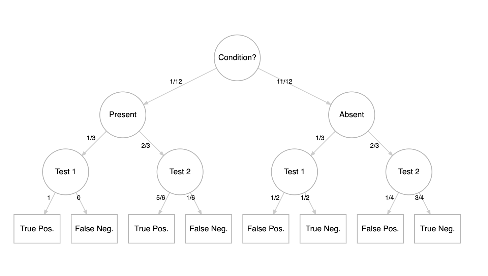

# Diagnostic Bayesian Network

Consider a particular medical condition $C$ with $\frac{1}{12}$ prevalence in the population.

$$P(C_+) = \frac{1}{12}$$

$$P(C_o) = 1 - P(C_+) =  \frac{11}{12}$$
  
 
There are two tests for this condition and doctors randomly choose test 1 $(T_1)$ with probability $\frac{1}{3}$ and test 2 $(T_2)$ with probability $\frac{2}{3}$. 

$$P(T_1) = \frac{1}{3}$$  

$$P(T_2) = \frac{2}{3}$$
  
 
If a given individual has the condition $(C_+)$, test 1 would correctly identify this with probability $1$ and test 2 would correctly identify this with probability $\frac{5}{6}$.

$$P(T^+|T_1 \cap C_+) = 1$$   
$$P(T^+|T_2 \cap C_+) = \frac{5}{6}$$
 

$$P(T^o|T_1 \cap C_+) = 1 - P(T^+|T_1 \cap C_+) = 0$$ 
$$P(T^o|T_2 \cap C_+) = 1 - P(T^+|T_2 \cap C_+) = \frac{1}{6}$$
 

If a given individual does not have the condition $(C_o)$, test 1 correctly identifies this with probability $\frac{1}{2}$ and test 2 correctly identifies this with probability $\frac{3}{4}$.

$$P(T^o | T_1 \cap C_o) = \frac{1}{2}$$ 
$$P(T^o | T_2 \cap C_o) = \frac{3}{4}$$
 

$$P(T^+ | T_1 \cap C_o) = 1 - P(T^o | T_1 \cap C_o) = \frac{1}{2}$$
$$P(T^+ | T_2 \cap C_o) = 1 - P(T^o | T_2 \cap C_o) = \frac{1}{4}$$
 

Imagine an individual is chosen completely at random from the population, they receive one of the tests, and the test comes out positive $(T^+)$. What is the probability that the individual actually has the disease $P(C_+|T^+)$?
 

**Approximately 1 in 5 positively tested patients will actually have the condition.**

